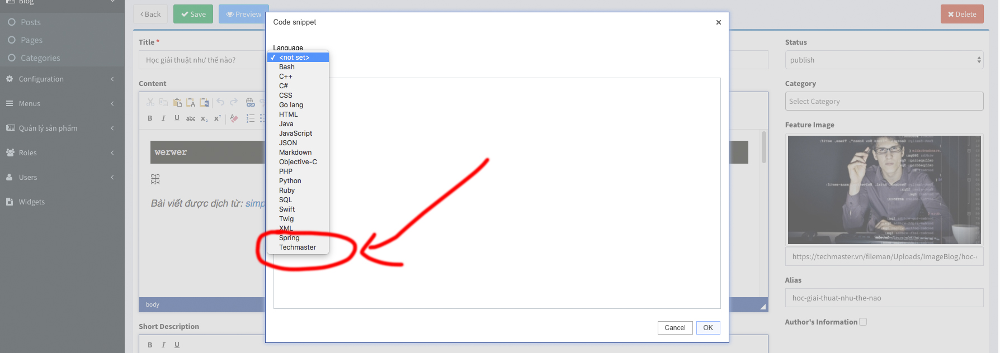

# Hướng dẫn làm hoàn chỉnh 1 trang web sử dụng ArrowCMS

- [Blog](https://github.com/thanhdat21293/Arrowcms-document/blob/master/blog.md)

- [Post](https://github.com/thanhdat21293/Arrowcms-document/blob/master/post.md)

- [Right sidebar](https://github.com/thanhdat21293/Arrowcms-document/blob/master/right_sidebar.md)

- [Categories](https://github.com/thanhdat21293/Arrowcms-document/blob/master/categories.md)

- [Page](https://github.com/thanhdat21293/Arrowcms-document/blob/master/page.md)

- [Contact sendmail](https://github.com/thanhdat21293/Arrowcms-document/blob/master/contact_sendmail.md)

Xong phần tạo blog, page, categories, submit form, Send email.


# Hướng dẫn làm hoàn chỉnh 1 trang web shop sử dụng ArrowCMS

#### Tải Eshop [Link](http://www.free-css.com/free-css-templates/page203/e-shopper)

#### Thêm theme Eshop vào ArrowCMS. Hướng dẫn: [add new theme](https://github.com/thanhdat21293/Arrowcms-document/blob/master/blog.md)

#### Tạo folders/files cần thiết cho frontend shop

Trong folder _/features/products/_

```
.
└── frontend
    ├── controllers
        └──product.js
    └── route.js
```

Code ban đầu cho file _route.js_

```
'use strict';

module.exports = function (component) {
    let comp = component.controllers.frontend;

    return {

        //Route o day


    }
};
```

Code ban đầu cho file _product.js_

```
'use strict';

const promise = require('arrowjs').Promise;

module.exports = function (controller, component, application) {

    let redis = application.redisClient;
    let adminPrefix = application.getConfig('admin_prefix') || 'admin';
    let redisPrefix = application.getConfig('redis_prefix') || 'arrowCMS_';
    let itemOfPage = application.getConfig('pagination').numberItem || 10;
    
    //Controllers xử lý ở đây
    
};
```

[Trang index: Features Items, Product tab theo categories, Recommended items](https://github.com/thanhdat21293/Arrowcms-document/blob/master/shopIndex.md)

Bài anh Cường giao:

Thêm options cho phần language ở Ckeditor nhé

Mình đã thêm được

Gợi ý: ở trong folder: _/themes/backend/_



