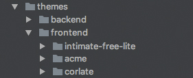
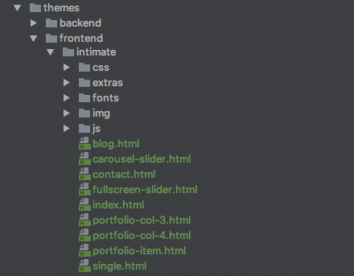
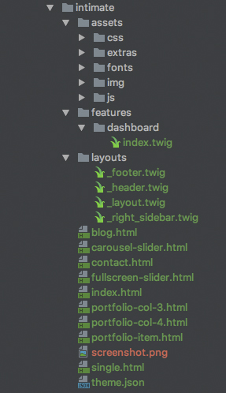
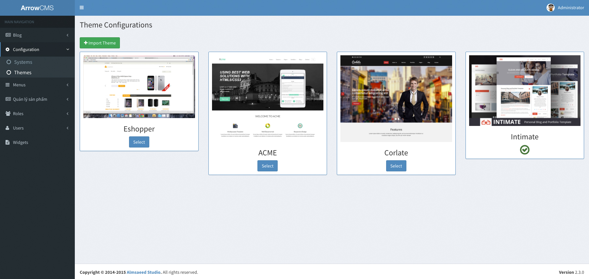
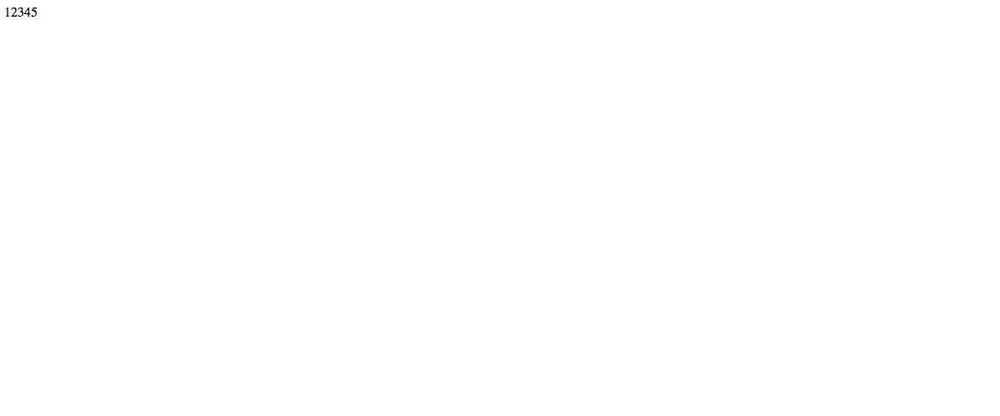
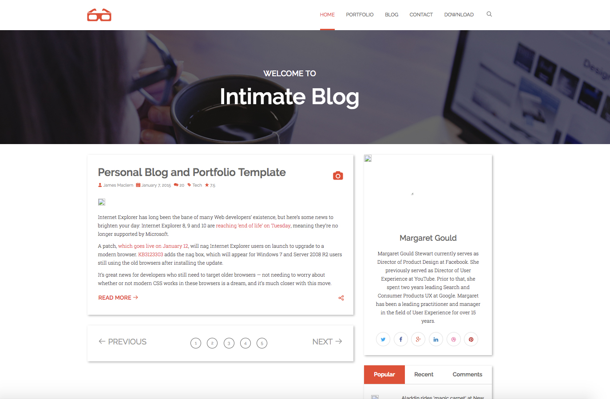

# Tạo blog từ ArrowCMS

## Tải arrowCMS

```
git clone https://github.com/arrowjs/CMS.git
cd CMS/
npm i
```

## Thêm 1 frontend theme mới

#### Bước 1: Tải template html 

Click vào: Download Lite Version
```
https://graygrids.com/item/intimate-free-personal-blog-and-portfolio-bootstrap-template/
```

#### Bước 2: Giải nén và copy vào _/themes/frontend/_



#### Bước 3: Sửa tên folder (Cũng chính là tên theme). Ví dụ: _intimate_



#### Bước 4: Áp dụng theme đúng với cấu trúc

Cấu trúc cơ bản của 1 theme
```
.
├── assets          
├── features        
├── layouts         
├── widgets         
├── screenshot.png  
└── theme.json      
```
- assets: Thư mục lưu các file css, jquery, image
- features: Lưu các file chính của website
- layouts: 
- widgets: 
- screenshot.png: Ảnh đại diện của theme
- theme.json: Để hệ thống có thể nhận được theme này.

Tạo folder, tạo file, di chuyển file để cho nó đúng với cấu trúc của theme.

```
.
├── assets
    ├── css
    ├── extras
    ├── fonts
    ├── img
    └── js
├── features
    └── dashboard
        └── index.twig
├── layouts
    ├── _footer.twig
    ├── _header.twig
    ├── _layout.twig
    └── _right_sidebar.twig
├── widgets       
├── screenshot.png
└── theme.json   
```



#### Buớc 5: Để nhận biết được 1 theme thì theme đó phải có file theme.json

Copy theme.json từ frontend theme khác và sửa cho đúng với theme mới

```
{
  "information": {
    "theme_name": "Intimate",
    "theme_uri": "https://shapebootstrap.net/item/1524962-corlate-free-responsive-business-html-template",
    "author": "SHAPEBOOTSTRAP",
    "author_email": "support@shapebootstrap.net",
    "version": "1.0",
    "description": "Free Responsive Business HTML Template",
    "license": "GNU General Public License v2 or later",
    "license_uri": "http://www.gnu.org/licenses/gpl-2.0.html",
    "tag": "bootstrap, corporate, html, responsive, corlate"
  },
  "sidebars": [
    {
      "name": "right-sidebar",
      "title": "Right sidebar"
    },
    {
      "name": "main-menu",
      "title": "Main nenu"
    }
  ]
}
```
Website sử dụng bao nhiêu sidebar thì chúng ta khai báo ở theme.json

#### Bước 6: Ảnh đại diện cho theme

Chọn ảnh đại diện cho theme và copy vào _/themes/frontend/intimate/_

Tên phải đúng chuẩn: _screenshot.png_


#### Bước 7: Đổi theme mặc định

Đường dẫn: _/config/view.js_

Tìm đến _frontendTheme_ và sửa đúng như tên folder theme.

```
...
frontendTheme: 'Tên folder theme',
...
```

#### Bước 8: Kiểm tra

Trong admin, kiểm tra xem theme _intimate_ đã được active chưa?



Trong frontend: 

- Sửa file _index.twig_ trong _themes/frontend/intimate/features/dashboard/_
    
    ```
    12345
    ```
   
- Chạy [http://localhost:8000](http://localhost:8000)




#### Bước 9: Chia nhỏ file

1) Copy tất cả nội dung file index.html vào file __layout.twig_

2) Copy phần header vào file __header.twig_

    - Phần code mất trong file __layout.twig_ sẽ được thay thế bằng 
    ```
    
    ```
    
    - File __header.twig_
    ```
    <header class="site-header">
        <nav class="navbar navbar-default navbar-intimate role="
        data-offset-top="50" data-spy="affix">
            <div class="container">
                <div class="navbar-header">
                    <!-- Start Toggle Nav For Mobile -->
                     <button class="navbar-toggle" data-target="#navigation"
                    data-toggle="collapse" type="button"><span class=
                    "sr-only">Toggle navigation</span> <span class=
                    "icon-bar"></span> <span class="icon-bar"></span>
                    <span class="icon-bar"></span></button>
                    <div class="logo">
                        <a class="navbar-brand" href="index.html"><i class=
                        "ico-3dglasses"></i></a>
                    </div>
                </div><!-- Stat Search -->
                <div class="side">
                    <a class="show-search"><i class="ico-search"></i></a>
                </div><!-- Form for navbar search area -->
                <form class="full-search">
                    <div class="container">
                        <div class="row">
                            <input class="form-control" placeholder="Search"
                            type="text"> <a class="close-search"><span class=
                            "ico-times"></span></a>
                        </div>
                    </div>
                </form><!-- Search form ends -->
                <!-- Navigation Start -->
                <div class="navbar-collapse collapse" id="navigation">
                    <ul class="nav navbar-nav navbar-right">
                        <li class="dropdown dropdown-toggle active">
                            <a data-toggle="dropdown" href=
                            "index.html">Home</a>
                            <ul class="dropdown-menu">
                                <li>
                                    <a href="fullscreen-slider.html">Home -
                                    Fullscreen Slider</a>
                                </li>
                                <li>
                                    <a href="carousel-slider.html">Home - Post
                                    Carousel</a>
                                </li>
                                <li>
                                    <a href="index.html">Home - Default</a>
                                </li>
                            </ul>
                        </li>
                        <li class="dropdown dropdown-toggle">
                            <a data-toggle="dropdown" href=
                            "portfolio.html">Portfolio</a>
                            <ul class="dropdown-menu">
                                <li>
                                    <a href="portfolio-col-3.html">Portfolio 3
                                    column</a>
                                </li>
                                <li>
                                    <a href="portfolio-col-4.html">Portfolio 4
                                    column</a>
                                </li>
                                <li>
                                    <a href="portfolio-item.html">Single
                                    Project</a>
                                </li>
                            </ul>
                        </li>
                        <li class="dropdown dropdown-toggle">
                            <a data-toggle="dropdown" href="#">Blog</a>
                            <ul class="dropdown-menu">
                                <li>
                                    <a href="blog.html">Blog View</a>
                                </li>
                                <li>
                                    <a href="single.html">Single Post</a>
                                </li>
                            </ul>
                        </li>
                        <li>
                            <a href="contact.html">Contact</a>
                        </li>
                        <li>
                            <a href="#">Download</a>
                        </li>
                    </ul>
                </div><!-- Navigation End -->
            </div>
        </nav><!-- Mobile Menu Start -->
    </header><!-- Header Section End -->
    <!-- Hero Area Start -->
    <section class="text-center" id="hero-area">
        <div class="container">
            <div class="row">
                <div class="col-md-12">
                    <div class="intro-area">
                        <h3>Welcome To</h3>
                        <h2 class="page-title">Intimate Blog</h2>
                    </div>
                </div>
            </div>
        </div>
    </section><!-- Hero Area End -->
    ```

3) Copy footer vào file __footer.twig_
    
    - Phần code mất trong file __layout.twig_ sẽ được thay thế bằng 
    ```
    
    ```
    
    - File __footer.twig_
    
    ```
    <footer class="footer">
        <div class="container">
            <div class="row">
                <div class="col-md-12">
                    <div class="footer-inner text-center">
                        <div class="social-links">
                            <a class="twitter social-link" data-placement="top"
                            data-toggle="tooltip" href="#" title=
                            "Twitter"><i class="fa fa-twitter"></i></a>
                            <a class="facebook social-link" data-placement=
                            "top" data-toggle="tooltip" href="#" title=
                            "Facebook"><i class="fa fa-facebook"></i></a>
                            <a class="google-plus social-link" data-placement=
                            "top" data-toggle="tooltip" href="#" title=
                            "Google+"><i class="fa fa-google-plus"></i></a>
                            <a class="linkedin social-link" data-placement=
                            "top" data-toggle="tooltip" href="#" title=
                            "LinkedIn"><i class="fa fa-linkedin"></i></a>
                            <a class="dribbble social-link" data-placement=
                            "top" data-toggle="tooltip" href="#" title=
                            "Dribbble"><i class="fa fa-dribbble"></i></a>
                            <a class="pinterest social-link" data-placement=
                            "top" data-toggle="tooltip" href="#" title=
                            "Pinterest"><i class="fa fa-pinterest"></i></a>
                        </div>
                        <ul class="footer-menu">
                            <li>
                                <a href="#">Home</a>
                            </li>
                            <li>
                                <a href="#">Portfolio</a>
                            </li>
                            <li>
                                <a href="#">Blog</a>
                            </li>
                            <li>
                                <a href="#">Contact</a>
                            </li>
                            <li>
                                <a href="#">Download</a>
                            </li>
                        </ul>
                        <div class="copyright">
                            <p>Copyright © 2016 IntimateBlog. Designed and Developed by
                            <a rel="nofollow" href="http://graygrids.com/">GrayGrids</a></p>
                        </div>
                    </div>
                </div>
            </div>
        </div>
    </footer>
    ```

4) Copy tất cả nội dung trong _div class="sidebar"_ vào file __right_sidebar.twig_
    
    - Phần code mất trong file __layout.twig_ sẽ được thay thế bằng 
    ```
    
    ```
    
    - File __right_sidebar.twig_
      
      Vì nội dung quá dài nên mình sẽ không thêm vào đây
    
5) Copy chỗ thẻ _article_ vào file _index.twig_

    Ở đây mình chỉ lấy 1 _article_, bỏ _article_ còn lại.
    
    _article_ cuối cùng là phân trang nên sẽ giữ lại
    
    File _index.twig_
    ```
    
    
    
    <article>
        <!-- Blog item Start -->
        <div class="blog-item-wrap">
            <!-- Post Format icon Start -->
            <div class="post-format">
                <span><i class="fa fa-camera"></i></span>
            </div><!-- Post Format icon End -->
            <h2 class="blog-title"><a href=
            "single.html">Personal Blog and Portfolio
            Template</a></h2><!-- Entry Meta Start-->
            <div class="entry-meta">
                <span class="meta-part"><i class=
                "ico-user"></i> <a href="#">James
                Maclern</a></span> <span class=
                "meta-part"><i class=
                "ico-calendar-alt-fill"></i> <a href=
                "#">January 7, 2015</a></span> <span class=
                "meta-part"><i class="ico-comments"></i>
                <a href="#">20</a></span> <span class=
                "meta-part"><i class="ico-tag"></i> <a href=
                "#">Tech</a></span> <span class=
                "meta-part"><i class="ico-star"></i> <a href=
                "#">7.5</a></span>
            </div><!-- Entry Meta End-->
            <!-- Feature inner Start -->
            <div class="feature-inner">
                <a data-lightbox="roadtrip" href=
                "img/blog/blog-01.jpg"></a>
            </div><!-- Feature inner End -->
            <!-- Post Content Start -->
            <div class="post-content">
                <p>Internet Explorer has long been the bane of
                many Web developers’ existence, but here’s some
                news to brighten your day: Internet Explorer 8,
                9 and 10 are <a href=
                "https://www.microsoft.com/en-us/WindowsForBusiness/End-of-IE-support"
                target="_blank">reaching&nbsp;‘end of life’ on
                Tuesday</a>, meaning they’re no longer
                supported by Microsoft.</p>
                <p>A patch, <a href=
                "https://support.microsoft.com/en-us/kb/3123303?sd=rss&amp;spid=14019"
                target="_blank">which goes live on January
                12</a>, will nag Internet Explorer users on
                launch to upgrade to a modern browser. <a href=
                "https://support.microsoft.com/en-us/kb/3123303?sd=rss&amp;spid=14019"
                target="_blank">KB3123303</a> adds the&nbsp;nag
                box, which will appear for Windows 7 and Server
                2008 R2 users still using the old browsers
                after installing the update.</p>
                <p>It’s great news for developers who still
                need to target older browsers — not needing to
                worry about whether or not modern CSS works in
                these browsers is a dream, and it’s much closer
                with this move.</p>
            </div><!-- Post Content End -->
            <div class="entry-more">
                <div class="pull-left">
                    <a class="btn btn-common" href=
                    "single.html">Read More <i class=
                    "ico-arrow-right"></i></a>
                </div>
                <div class="share-icon pull-right">
                    <span class="socialShare"></span>
                </div>
            </div>
        </div><!-- Blog item End -->
    </article>
    
    <article>
        <!-- Pagination Start -->
        <ul class="pager">
            <li class="previous">
                <a href="#"><i class="ico-arrow-left"></i>
                Previous</a>
            </li>
            <li style="list-style: none"><span class=
            "active"><a href="#">1</a></span> <span><a href=
            "#">2</a></span> <span><a href="#">3</a></span>
            <span><a href="#">4</a></span> <span><a href=
            "#">5</a></span></li>
            <li class="next">
                <a href="#">Next <i class=
                "ico-arrow-right"></i></a>
            </li>
        </ul><!-- Pagination End -->
    </article>
    
    
    ```
    
    - extends: nó sẽ kế thừa tất cả nội dung của __layout.twig_
    - _ ... _ : Để thay thế nội dung trong _block content_ của thằng cha nó.


6) File __layout.twig_ 

    Mình chỉ copy phần thay đổi thôi
    
    ```
    <!-- Header Section Start -->
        
        <!-- Content Start -->
        <div id="content">
            <div class="container">
                <div class="row">
                    <div class="col-md-8">
                        <!-- Blog Article Start-->
                        
    
                        
                        <!-- Blog Article End-->
                    </div>
                    <div class="col-md-4">
                        
                    </div>
                </div>
            </div>
        </div><!-- Content End -->
        <!-- Footer Start -->
        
    <!-- Footer End -->
    ```
    
    Do _index.twig_ kế thừa từ __layout.twig_ nên ở đây ta sẽ ko gọi _include "index.twig"_.
    
    Ta sẽ dùng 
    
    ```
    
    
    
    ```
    
    Tại sao sử dụng ... thì xem ở ngay trên sẽ thấy.

7) Chỉnh lại đường dẫn cho file css, js

    Trong file __layout.twig_
    
    ``` 
        <link href="css/bootstrap.min.css" madia="screen" rel="stylesheet" type="text/css">
        <script src="js/jquery-min.js" type="text/javascript"></script>
    ```
    
    Sửa thành
    
    ``` 
        <link href="/frontend/<folder theme>/assets/css/bootstrap.min.css" madia="screen" rel="stylesheet" type="text/css">
        <script src="/frontend/<folder theme>/assets/js/jquery-min.js" type="text/javascript"></script>
    ```
    
    Ở đây mình ví dụ 2 file, còn khi làm chúng ta sẽ sửa tất cả.
    
    Sau khi sửa xong giao diện sẽ như này:




## Hiển thị blog, phân trang

#### Bước 1: Chỉnh sửa số post trên 1 trang

Đường dẫn: _/config/view.js_

Tìm đến 
```
...
pagination: {
    numberItem: 5,
    frontNumberItem: 5
}
...
```

#### Bước 2: Thêm post 

Trong _http://localhost:7000/admin/blog/posts_

Chúng ta sẽ thêm post > 5 (số post trên 1 trang) để có ít nhất 2 trang

#### Bước 3: Hiển thị dữ liệu

Ta thấy blog được hiển thị ở trang chủ nên chúng ta sẽ chỉnh sửa trong _/features/dashboard/_

1) Chỉnh sửa file _features/dashboard/frontend/controllers/index.js_ để lấy dữ liệu và trả về frontend

```
'use strict';

module.exports = function (controller, component, application) {

    controller.index = function (req, res) {
        
        let page = req.params.page || 1;
        let itemOfPage = application.getConfig('pagination').frontNumberItem || 5;
        let totalPage = 1;
        
        application.feature.blog.actions.findAndCountAll({
            where : {
                published: 1,
                type: 'post'
            },
            include: [{
                model: application.models.user
            }],
            limit: itemOfPage,
            offset: (page - 1) * itemOfPage
        })
            .then(data => {
                totalPage = Math.ceil(data.count/itemOfPage);
                res.frontend.render('index', {
                    postTitle: 'Blog page',
                    posts: data.rows,
                    page: page,
                    itemOfPage: itemOfPage,
                    totalPage: totalPage
                })
            })

    };
};
```

- page: Số trang hiện tại. Mặc định là 1.

- itemOfPage: Số post trên 1 trang được lấy từ config

- totalPage: Tổng số trang

- Dùng application để chạy function trong _/features/blog/actions/post.js_. Dùng Sequelize để lấy dữ liệu

``` 
application.feature.blog.actions.findAndCountAll({
    where : {
        published: 1,
        type: 'post'
    },
    include: [{
        model: application.models.user
    }],
    limit: itemOfPage,
    offset: (page - 1) * itemOfPage
})
```
- where: Truy vấn các trường trong CSDL
- include: Do blog có foreignKey là 'created_by' chính là _id_ của _user_ nên ta dùng include để lấy thông tin user tạo blog
- limit: Giới hạn post trên 1 trang
- offset: Lấy từ post thứ mấy. Ví dụ: nếu có 20 post, có limit = 5, offset = 10 thì ta sẽ lấy được sp thứ: 10,11,12,13,14

Các câu lệnh truy vấn các bạn xem tại [Sequelize](http://docs.sequelizejs.com/manual/installation/getting-started.html)

2) Hiển thị ra frontend

```
.then(data => {
    totalPage = Math.ceil(data.count/itemOfPage);
    res.frontend.render('index', {
        postTitle: 'Blog page',
        posts: data.rows,
        page: page,
        itemOfPage: itemOfPage,
        totalPage: totalPage
    })
})
```

- totalPage: tổng số trang
- res.frontend.render: vì chúng ta có _frontend_ và _backend_, 2 cái đều render ra giao diện nên sẽ có 2 kiểu render _res.frontend.render_ và res.backend.render.

3) Hiển thị dữ liệu frontend

- Nội dung
```

<article>
    <!-- Blog item Start -->
    <div class="blog-item-wrap">
        <!-- Post Format icon Start -->
        <div class="post-format">
            <span><i class="fa fa-camera"></i></span>
        </div><!-- Post Format icon End -->
        <h2 class="blog-title"><a href=
        "single.html">{{ post.title }}</a></h2><!-- Entry Meta Start-->
        <div class="entry-meta">
            <span class="meta-part">
                <i class="ico-user"></i>
                <a href="#">{{ post.user.display_name }}</a>
            </span>
            <span class="meta-part">
                <i class="ico-calendar-alt-fill"></i>
                <a href="#">{{ post.published_at | moment('DD-MM-YYYY') }}</a>
            </span>
            <span class="meta-part">
                <i class="ico-comments"></i>
                <a href="#">20</a>
            </span>
            <span class="meta-part">
                <i class="ico-tag"></i>
                <a href="#">Tech</a>
            </span>
            <span class="meta-part">
                <i class="ico-star"></i>
                <a href="#">7.5</a>
            </span>
        </div><!-- Entry Meta End-->
        <!-- Feature inner Start -->
        
        <div class="feature-inner">
            <a data-lightbox="roadtrip" href="{{ post.image }}">
                
            </a>
        </div>
        
        <!-- Feature inner End -->
        <!-- Post Content Start -->
        <div class="post-content">
            {{ post.intro_text | safe }}
        </div><!-- Post Content End -->
        <div class="entry-more">
            <div class="pull-left">
                <a class="btn btn-common" href=
                "single.html">Read More <i class=
                "ico-arrow-right"></i></a>
            </div>
            <div class="share-icon pull-right">
                <span class="socialShare"></span>
            </div>
        </div>
    </div><!-- Blog item End -->
</article>

```

- Phân trang

```

<article>
    <!-- Pagination Start -->
    <ul class="pager">
        <li class="previous">
            <a href="#"><i class="ico-arrow-left"></i>
            Previous</a>
        </li>
        <li style="list-style: none">
            
                
                    <span class="active">
                        <a href="javascript:void(0)">{{ i }}</a>
                    </span>
                
                    <span class="">
                        <a href="/page/{{ i }}">{{ i }}</a>
                    </span>
                
            
        </li>
        <li class="next">
            <a href="#">Next <i class=
            "ico-arrow-right"></i></a>
        </li>
    </ul><!-- Pagination End -->
</article>

```