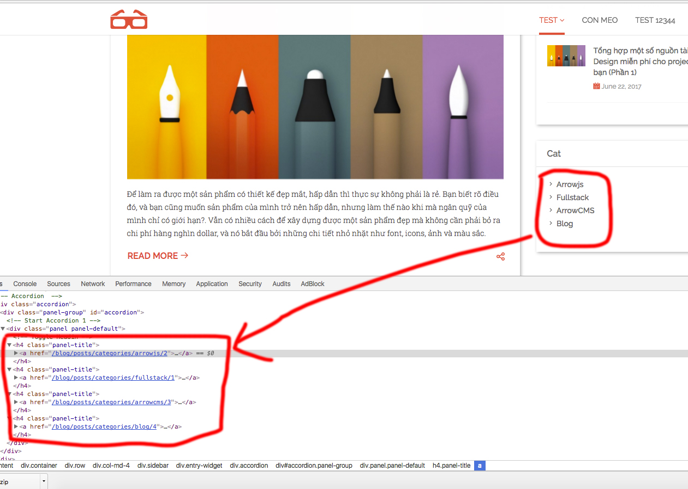

## Hiển thị danh sách post theo category

Route xử lý đường dẫn tới trang category đã có sẵn ở trong _/features/blog/frontend/route.js_

```
"/blog/posts/categories/:alias([0-9a-zA-Z-]+)/:id([0-9]+)(/)?": {
    get: {
        handler: controller.listPostByCategory
    }
}
```

Các categories ở widget ta sẽ để đường dẫn như trên



Ta thấy khi chạy categories nó sẽ xử lý ở trong _controller.listPostByCategory_

Kiểm tra xem khi render nó sẽ render ra file nào thì tạo file đó.

Nếu bạn muốn file khác cũng đc, chỉ cần đổi tên file và tên file trong render.

Tìm trong _controller.listPostByCategory_, hàm xử lý render ra file posts

```
res.frontend.render('posts', {...
```

Trong server thì frontend cần những gì, ta truyền nó ra.

Tạo file để hiển thị, extension là _twig_ nên ta tạo file _posts.twig_ trong theme.

Code content 

```
<article>
    <!-- Blog item Start -->
    <div class="blog-item-wrap">
        <!-- Post Format icon Start -->
        <div class="post-format">
            <span><i class="fa fa-camera"></i></span>
        </div><!-- Post Format icon End -->
        <h2 class="blog-title"><a href="single.html">Personal Blog and Portfolio
        Template</a></h2><!-- Entry Meta Start-->
        <div class="entry-meta">
            <span class="meta-part"><i class="ico-user"></i> <a href="#">James
            Maclern</a></span> <span class="meta-part"><i class="ico-calendar-alt-fill"></i> <a href="#">January 7, 2015</a></span> <span class="meta-part"><i class="ico-comments"></i>
            <a href="#">20</a></span> <span class="meta-part"><i class="ico-tag"></i> <a href="#">Tech</a></span> <span class="meta-part"><i class="ico-star"></i> <a href="#">7.5</a></span>
        </div><!-- Entry Meta End-->
        <!-- Feature inner Start -->
        <div class="feature-inner">
            <a data-lightbox="roadtrip" href="img/blog/blog-01.jpg"></a>
        </div><!-- Feature inner End -->
        <!-- Post Content Start -->
        <div class="post-content">
            <p>Internet Explorer has long been the bane of
            many Web developers’ existence. </p>
        </div><!-- Post Content End -->
        <div class="entry-more">
            <div class="pull-left">
                <a class="btn btn-common" href="single.html">Read More <i class="ico-arrow-right"></i></a>
            </div>
            <div class="share-icon pull-right">
                <span class="socialShare socialPlugin"><span class="showSocialButtons ico-share"></span><span class="socials" style="width: 300px; margin-left: -296px;"><a class="ico-twitter-with-circle twitter" href="undefined"></a><a class="ico-facebook-with-circle facebook" href="undefined"></a><a class="ico-google-with-circle google-plus" href="undefined"></a><a class="ico-linkedin-with-circle linkedin" href="undefined"></a><a class="ico-dribbble-with-circle dribbble" href="undefined"></a><a class="ico-pinterest-with-circle pinterest" href="undefined"></a></span></span>
            </div>
        </div>
    </div><!-- Blog item End -->
</article>
```

Code phân trang

```
<article>
    <!-- Pagination Start -->
    <ul class="pager">
        <li class="previous">
            <a href="#"><i class="ico-arrow-left"></i>
            Previous</a>
        </li>
        <li style="list-style: none"><span class="active"><a href="#">1</a></span> <span><a href="#">2</a></span> <span><a href="#">3</a></span>
        <span><a href="#">4</a></span> <span><a href="#">5</a></span></li>
        <li class="next">
            <a href="#">Next <i class="ico-arrow-right"></i></a>
        </li>
    </ul><!-- Pagination End -->
</article>
```
