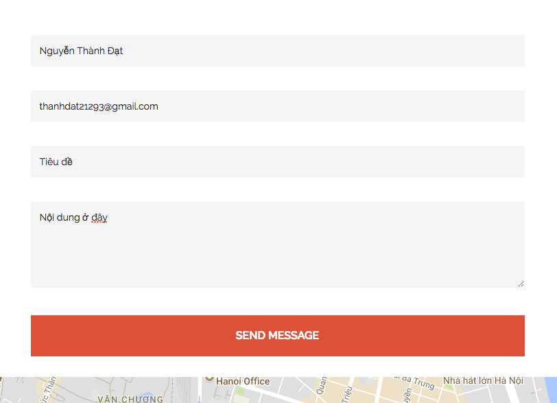
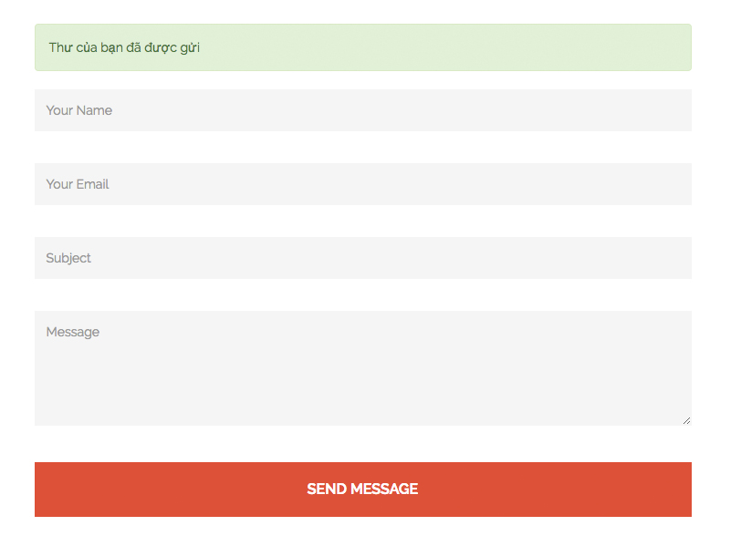
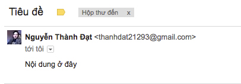

## Send mail sử dụng nodemailer

#### Bước 1: cài đặt modules để gửi mail

```
npm i nodemailer
```

Vào (https://myaccount.google.com/security) kéo xuống cuối trang rồi 'Bật' Cho phép ứng dụng kém an toàn.

Cách sử dụng: [nodemailer](https://nodemailer.com/about/)


#### Bước 2: Kiểm tra thông tin cần thiết form ở frontend

1) Form: 

- action: 'localhost:8000/contact' // Khi submit nó sẽ chạy đến URL khai báo ở action, nếu chạy đến trang hiện tại thì ko cần action

- method: post/get // Phương thức truyền

2) Input: các input cần có _name_ để server có thể lấy được giá trị nhập

#### Bước 3: Tạo function trong controllers để xử lý dữ liệu, gửi mail và render

Tạo 1 hàm controllers để xử lý, chúng ta đang làm cho page nên sẽ thêm vào file _page.js_

```
controller.pageSubmit
```

Trong _route.js_ sẽ thêm hàm post vì form chúng ta sử dụng phương thức post

```
post: {
    handler: controller.pageSubmit
}
```

Thêm vào _route_ dưới vì chúng ta đang xử lý ở chính page này

```
"/blog/:alias([a-zA-Z0-9-]+)(/)?":
```

Sau đó, vào _controller.pageSubmit_ để xử lý dữ liệu

- Khai báo ngoài _export_

```
const nodemailer = require('nodemailer');

let transporter = nodemailer.createTransport({
    service: 'gmail',
    auth: {
        user: 'username@example.com',
        pass: 'userpass'
    }
});
```

- Gửi mail + lấy dữ liệu
   
  Dữ liệu lấy từ from ở frontend để gửi mail

```
let mailOptions = {
    from: '"Fred Foo 👻" <foo@blurdybloop.com>', // sender address
    to: 'bar@blurdybloop.com, baz@blurdybloop.com', // list of receivers
    subject: 'Hello ✔', // Subject line
    text: 'Hello world ?', // plain text body
    html: '<b>Hello world ?</b>' // html body
};

transporter.sendMail(mailOptions, (error, info) => {
    if (error) {
        return console.log(error);
    }
    
    app.feature.blog.actions.find({
        include: [
            {
                model: app.models.user,
                attributes: ['id', 'display_name', 'user_email', 'user_image_url']
            }
        ],
        where: {
            alias: req.params.alias,
            type: 'page',
            published: 1
        }
    }).then(function (results) {
        
    });
});


```

- Hiển thị dữ liệu

```
res.frontend.render('page', {
    item: results.dataVa lues,
    postTitle: results.dataValues.title,
    layout: results.dataValues.title
});
```
#### Bước 4: Kiểm tra

Nội dung gửi 



Gửi thành công



Kết quả

