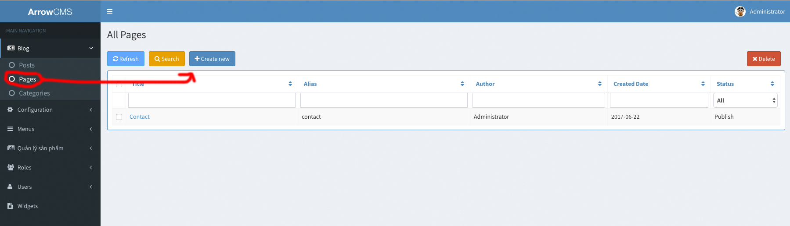
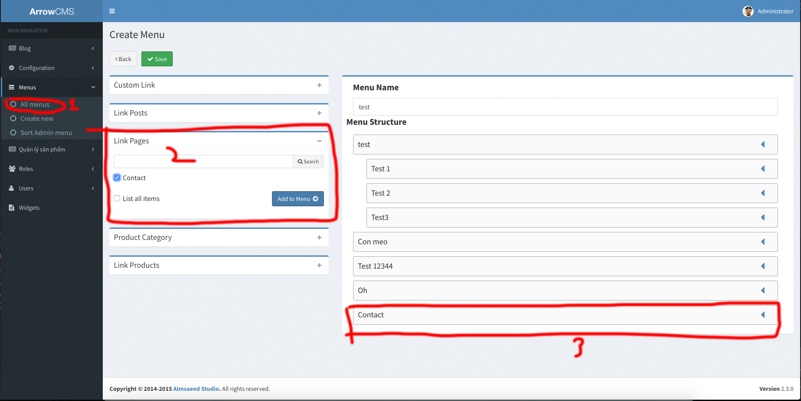
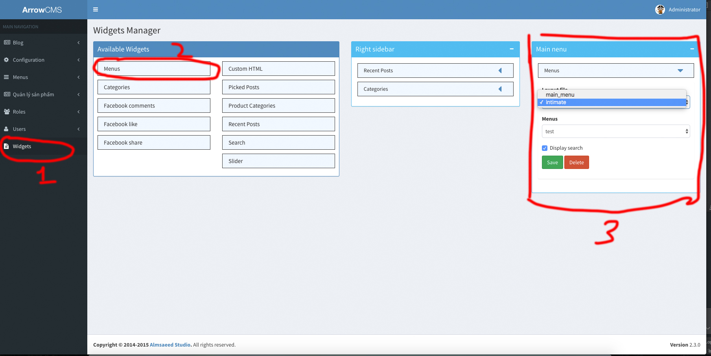
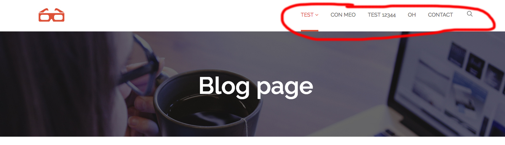
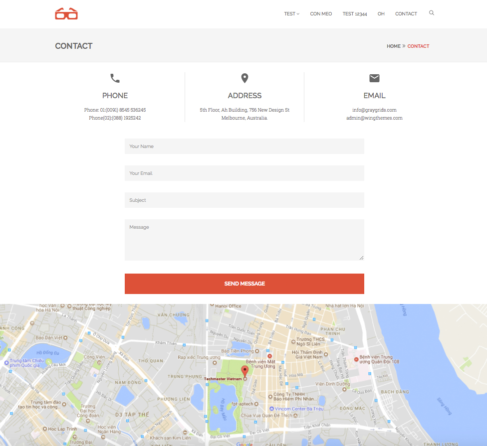

# Tạo page

### Bước 1: Chỉnh lại route với menu cho khớp

Vì _page_ và _post_ ta viết trong _/features/blog/_ nên ta sẽ xử lý phần server trong này.

Vào _/features/blog/backend/controllers/page.js_, function _linkMenuPage_ sửa

    ```
    link_template: '/{alias}'
    ```
    
    thành
    
    ```
    link_template: '/blog/{alias}'
    ```
    
Tạo 1 page trong admin



Thêm page vào menu, nếu chưa có menu thì tạo 1 menu



Vào _widgets_, kéo menu vào sidebar _Main menu_ rồi chọn layout của theme (Không nhớ tên layout thì vào _themes/frontend/{theme active}/widgets/menus_) thì tên file chính là tên layout.



Ra ngoài frontend, reload lại thì thấy có _contact_ vừa thêm là ok



### Bước 2: Layout riêng cho page _contact_

Vì phần layout của _contact_ có phần map hiển thị full width nên sẽ ko sử dụng

```
 
```

Mà ta thêm 1 block nữa ở __layout.twig_

```

<div id="content">
    <div class="container">
        <div class="row">
            <div class="col-md-8">
                <!-- Blog Article Start-->
                

                
                <!-- Blog Article End-->
            </div>
            <div class="col-md-4">
                
            </div>
        </div>
    </div>
</div><!-- Content End -->

```

Ở _contact_: 

- Vì trang _contact_ có phần googlemap hiển thị full width nên nó sẽ nằm ngoài thẻ _id = contnet_ 
    
    Phần content các bạn tự thêm.
```


//Content contact.



    //Sử dụng embed google maps



```

Giao diện khi hoàn thành

- Vì map trong contact khi dùng phải điền API Key nên ta sử dụng Embed map google vậy. Vào đây search địa điểm rồi lấy code thêm vào contact (https://www.google.com/maps)




## Bài thực hành

Tạo 1 page 'About' và hiển thị nội dung _full_text_ và ảnh.

