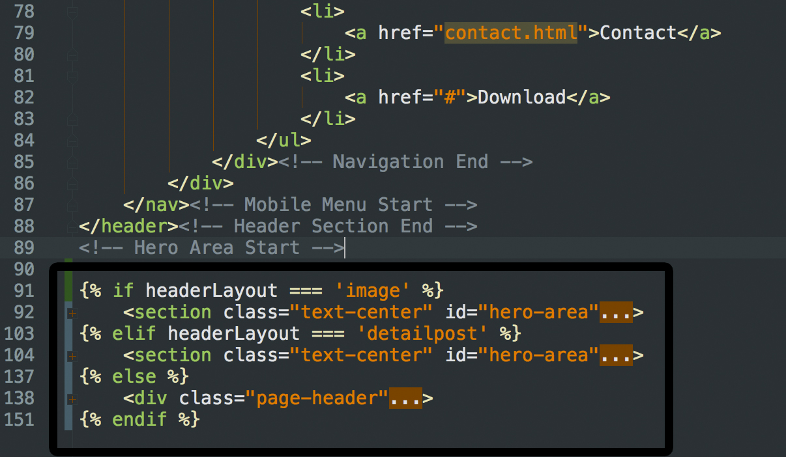
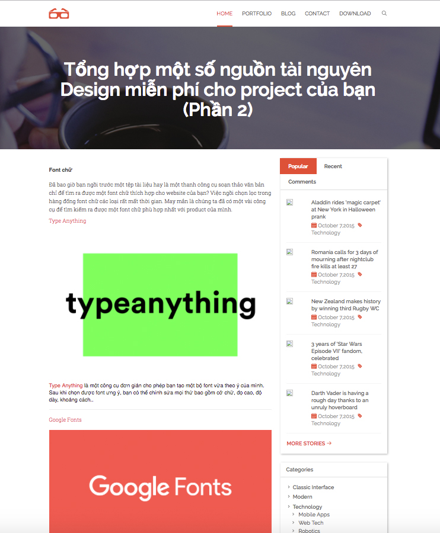

# Tạo trang chi tiết blog

#### Bước 1: Tạo route cho trang chi tiết

Chúng ta sẽ tạo đường dẫn cho trang chi tiết

Vào file _/features/blog/frontend/route.js_

Nhìn thấy nó đã có sẵn route chi tiết rồi nên chỉ việc sử dụng thôi

```
"/blog/posts/:postId([0-9]+)/:postAlias": {
    get: {
        handler: controller.postDetail
    }
}
```

#### Bước 2: Tạo file hiển thị chi tiết blog

Phần view

Vì chúng ta tạo giao diện cho trang chi tiết blog nên sẽ vào _/themes/frontend/{Theme active}/features/_

- Tạo folder _blog_: tên folder trùng với các _features_

- Tạo file _post.twig_: để hiển thị trang chi tiết

Copy code từ file _single.html_ sang _post.twig_. Chỉ lầy phần content thôi.

Và cũng như file _index.twig_, _post.twig_ sẽ kế thừa từ thằng __layout.twig_. 

Nội dung html trong _post.twig_ sẽ nằm trong _ _
    

#### Bước 3: Đặt đường dẫn cho đúng với _route_

Ta sử dụng _route_ ở **Bước 1** nên đường dẫn cũng phải đặt đúng theo _route_

Ở trang chủ click post nào sẽ vào trang chi tiết post đó nên ta cần sửa đường dẫn ở _title_ và _Read more_ trong file _index.twig_

Phần này các bạn tự lấy id vs alias, cái dưới là demo thôi
```
/blog/posts/{id}/{alias}
```

Gán vào href của thẻ _a_
Ví dụ: 

```
<a href="/blog/posts/{id}/{alias}"></a>
```

Chạy http://localhost:8000, click vào 1 post mà hiển thị như hình là ok


#### Bước 4: Tìm đến file xử lý dữ liệu

Để tìm được nó chạy và lấy dữ liệu như nào thì đầu tiên ta xem URL là gì.

Ví dụ: 

- url là http://localhost:8000
  
  Ta thấy đây là trang index, route nhận đc sẽ ở trong folder _/features/dashboard/_
  
  Khi tìm đc _route_ thì ta kiểm tra tiếp nó sẽ lấy dữ liệu và render như nào thì kiểm tra _handler_
  
  ```
  handler: controller.index
  ```
  
  Ở đây nó dùng _controller.index_ tức là sử dụng controllers
  
  Vào trong thư mục _controllers/_ thì sẽ thấy được file, file đó sẽ xử lý dữ liệu và render.
    
    
Ở đây đường dẫn khi click vào 1 post là: 

```
http://localhost:8000/blog/posts/{id}/{alias}
```

Tìm file route xử lý. Ta đang làm phần blog nên sẽ vào _/features/blog/frontend_

Thấy trong file _route.js_ có hàm giống với đường dẫn nên khi chạy đường dẫn trên nó sẽ vào _route_ này

```
"/blog/posts/:postId([0-9]+)/:postAlias": {
    get: {
        handler: controller.postDetail
    }
},
```
- Tại sao chúng ta sử dụng _:postId([0-9]+)_ mà không phải là _postId([0-9]+)_. 
  
  Vì _:postId([0-9]+)_ ở đây nó là 1 params và ko cố định đường dẫn như _/blog/posts/postId_
  
  Và chúng ta có thể lấy được giá trị này ở server để xử lý.

Tiếp theo, nó sẽ chạy _controller.postDetail_

Trong folder _controllers/_ có 2 file _page.js_ và _post.js_. Ta chỉ sử dụng _post.js_ vì đang làm trang chi tiết blog.

Khi đó chúng ta sẽ vào _/features/blog/frontend/controllers/post.js_ tìm đến _controller.postDetail_ để xử lý dữ liệu và render ra frontend.

#### Bước 5: Lấy dữ liệu và hiển thị frontend

Code xử lý dữ liệu và render:

```
controller.postDetail = function (req, res) {
    let postId = req.params.postId;

    app.feature.blog.actions.find({
        where: {
            id: postId,
            type: 'post',
            published: 1
        },
        raw: true
    }).then(function (post) {
        if (post) {
            // Get id of category contain post
            let ids = post.categories.split(':');
            let category_ids = [];
            if (ids.length > 0) {
                for (var i = 0; i < ids.length; i++) {
                    if (Number(ids[i])) {
                        category_ids.push(Number(ids[i]));
                    }
                }
            }
            // Query category contain post and render
            app.feature.category.actions.findAll({
                where: {
                    id: {
                        $in: category_ids
                    }
                }
            }).then(function (categories) {
                // Render view
                res.frontend.render('post', {
                    post: post,
                    categories: categories,
                    headerLayout: 'image',
                    postTitle: post.title
                });
            });
        } else {
            // Redirect to 404 if post not exist
            res.frontend.render('_404');
        }
    });
};
```

- req.params.postId: lấy id từ URL

  ví dụ: url là: http://localhost:8000/blog/post/3/alias
  
  thì _req.params.postId_ = 3.
  
- raw: true : Dùng Sequelize lấy dữ liệu nó sẽ trả về 1 đống lung tung nên ta dùng cái này để nó chỉ lấy dữ liệu trong database.

- Trong database ta lưu categories của 1 bài như sau :3:4:1: nên Đoạn code này để cho id categories vào 1 mảng: [3, 4, 1]
    ```
    let ids = post.categories.split(':');
    let category_ids = [];
    if (ids.length > 0) {
        for (var i = 0; i < ids.length; i++) {
            if (Number(ids[i])) {
                category_ids.push(Number(ids[i]));
            }
        }
    }
    ```
    
- Lấy thông tin các categories

    ```
    app.feature.category.actions.findAll({
        where: {
            id: {
                $in: category_ids
            }
        }
    })
    ```

- Lấy thông tin user sử dụng
    ```
    include: [{
                model: app.models.user
            }]
    ```

Phần hiển thị dữ liệu frontend các bạn tự làm nhé.


#### Bước 6: Hiển thị header

Thấy 3 file: index.html, single.html, contact.html có header khác nhau nên ta sẽ chia thành 3 loại header

Khi đó mỗi lần render ta sẽ thêm 1 biến _headerLayout_, gồm 3 kiểu:
- image: (header giống trang index.html)
- detailpost: (header giống trang post.html)
- Trường hợp còn lại, header giống trang contact.html

File __header.twig_ sẽ như sau:



Vậy khi render thì nếu trang nào dùng header nào ta chỉ việc thêm:

```
headerLayout: 'image'
hoặc
headerLayout: 'detailpost'
```

Giao diện sau khi hoàn thành. Mỗi bài post sẽ có tiêu đề với nội dung khác nhau và dữ liệu đc lấy tự động




