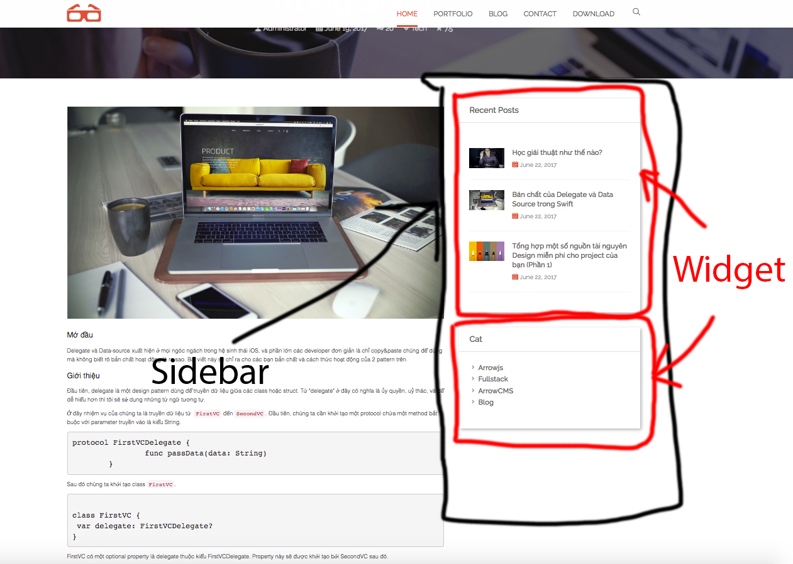
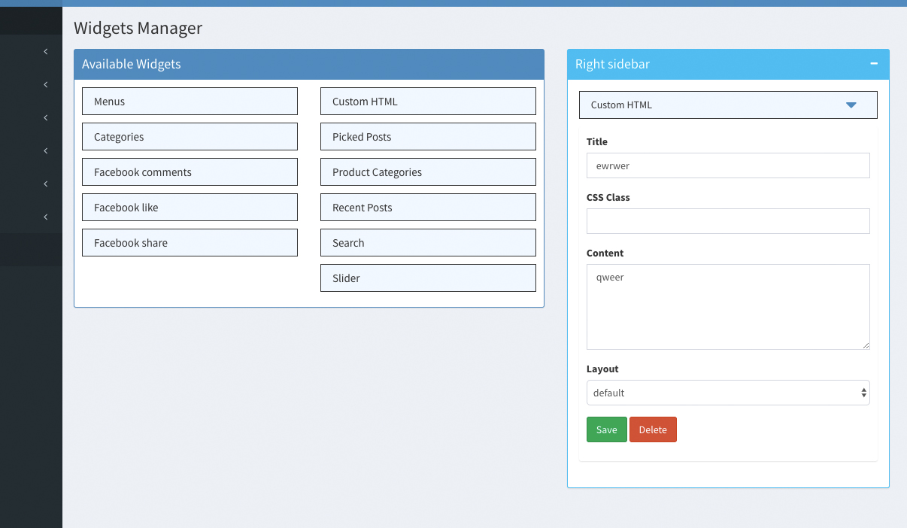
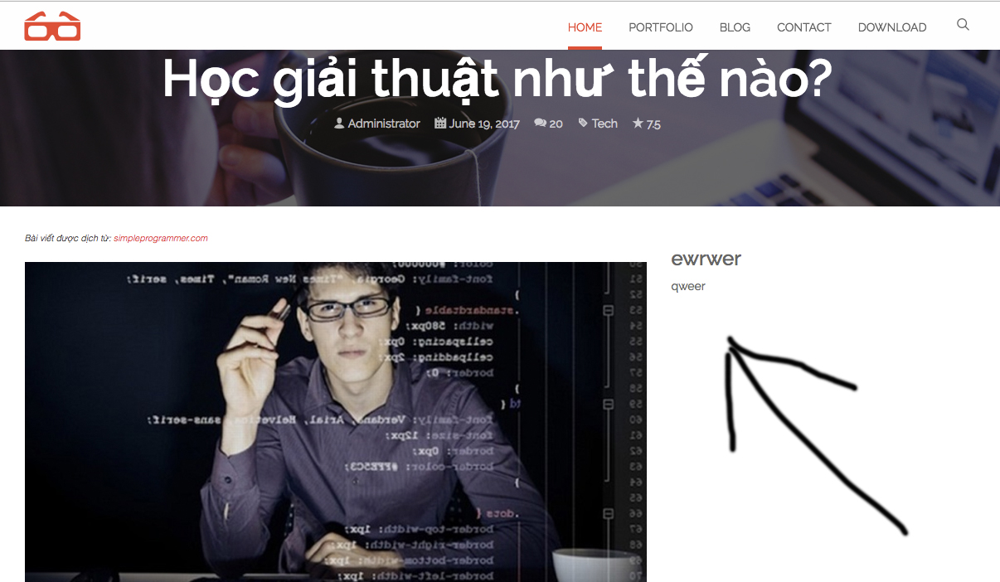
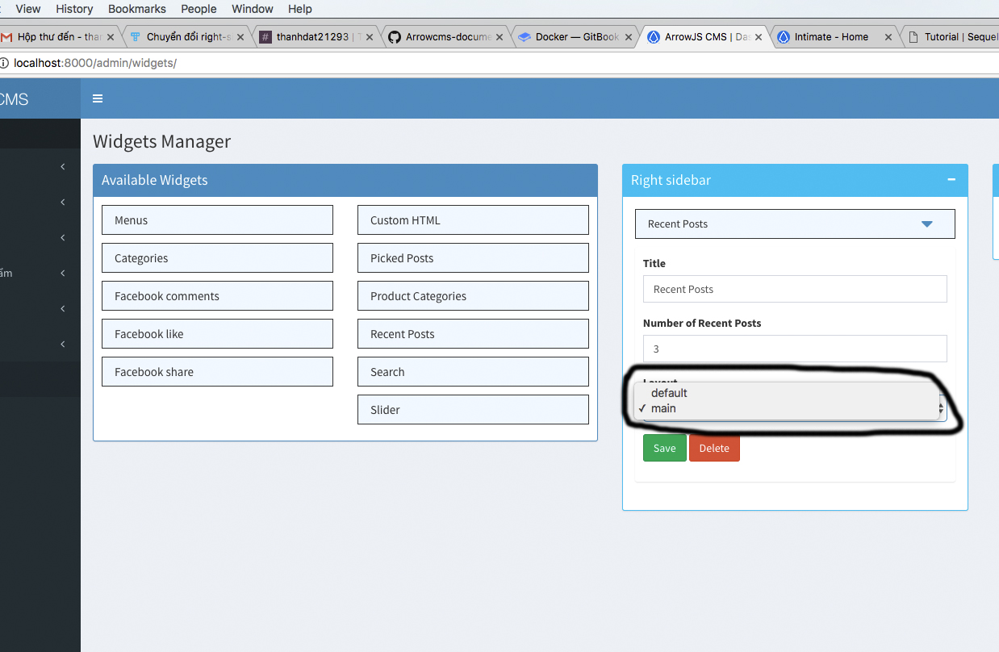
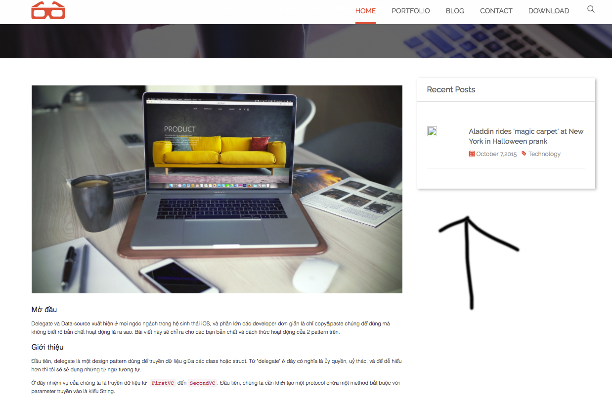

# Sidebar + Widget



Widget sẽ được kéo thả trong _http://localhost:8000/admin/widgets/_. Và sẽ được lưu theo dạng json trong database.

Ở file __right_sidebar.twig_ ta sẽ gọi 1 hàm để lấy sidebar và bỏ tất cả code khác

File __right_sidebar.twig_ mới
```
<div class="sidebar">
    {{ getSidebar('right-sidebar') | async | safe }}
</div>
```

Hàm này sẽ tự động vào database, bảng _arr_wiget_ để lấy tất cả _widgets_ trong nó để hiển thị.

Giao diện widgets sẽ được lấy trong _/themes/frontend/{theme active}/wigets/_. Nếu không có thì nó sẽ lấy mặc định ở _/widgets/_

## Test

Vào admin -> widgets

Kéo thử _Custom HTML_ vào _Right sidebar_, điền title, content rồi save lại.



Chạy http://localhost:8000 và kiểm tra

- Phần widget này chưa đúng định dạng là vì nó đang sử dụng widget mặc định. Để có thể hiển thị được như sidebar ban đầu thì ta thêm widgets vào themes



## Thêm widget

Demo 1 widgets:

HTML sử dụng sidebar của theme, hiển thị dữ liệu lấy của widget mặc định: _CMS/widgets/_
    
1) Recent Posts
    
    Trong _/themes/frontend/{theme active}/widgets/_.
    - Tạo folder _recent_posts_ (Tên folder giống với widget mặc định)
    - Tạo file _main.twig_ khi đó trong widget admin sẽ 2 layout: default (tên widget mặc định), main (File vừa tạo)
      
      
      
- Phần HTML

    Copy HTML phần Recent posts ở file HTML vào file _/themes/frontend/{Theme active}/widgets/recent_posts/default.twig_
    
    Phần header sẽ ko sử dụng tab nữa
    
        Bỏ 
        ```
        <ul class="nav nav-tabs">
                <li class="active">
                    <a data-toggle="tab" href=
                    "#tab1">Popular</a>
                </li>
                <li>
                    <a data-toggle="tab" href=
                    "#tab2">Recent</a>
                </li>
                <li>
                    <a data-toggle="tab" href=
                    "#tab3">Comments</a>
                </li>
            </ul><!-- Tab Panels -->
        ```
        
        Thay bằng
        
        ```
        <h5 class="widget-title">Recent Posts</h5>
        ```
    
    Các phần lặp đi lặp lại ta bỏ hết, giữ lại 1 cái
    
    
    
    Vào _/widgets/recent_posts/default.twig_ để xem cách lấy dữ liệu như nào để áp dụng vào widget mới
    


## Bài tập

Các bạn convert tất cả widget còn lại.

Riêng _menus_ thì ta sẽ thay thế menu ở header nên hàm gọi menu là:

```
{{ getSidebar('main-menu') | async | safe }}
```